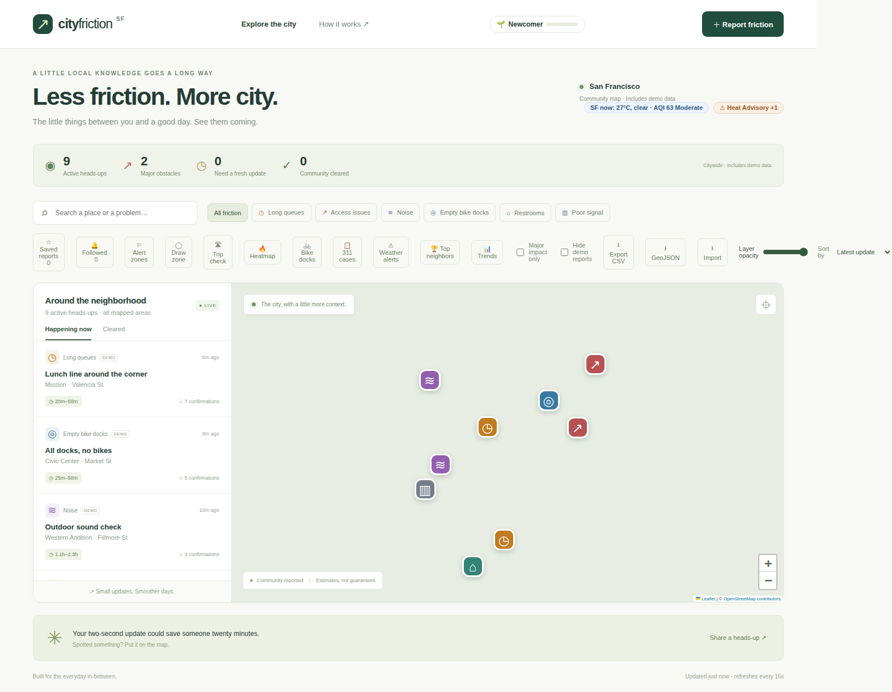
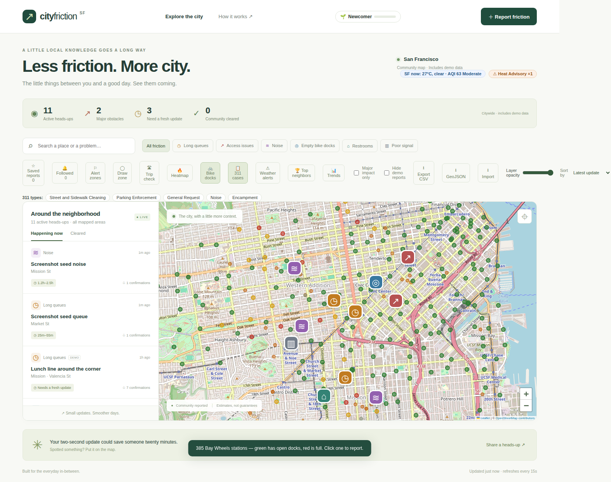
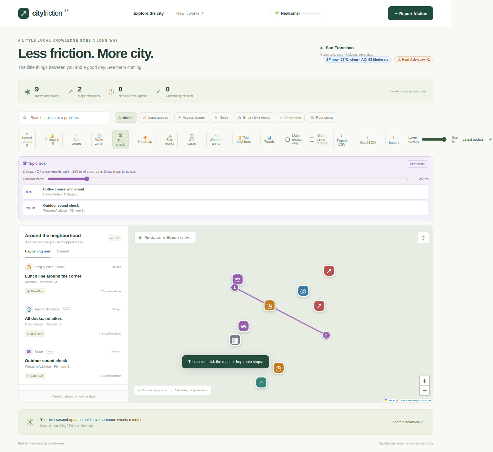
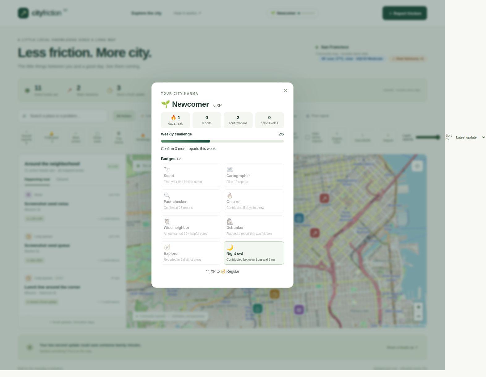
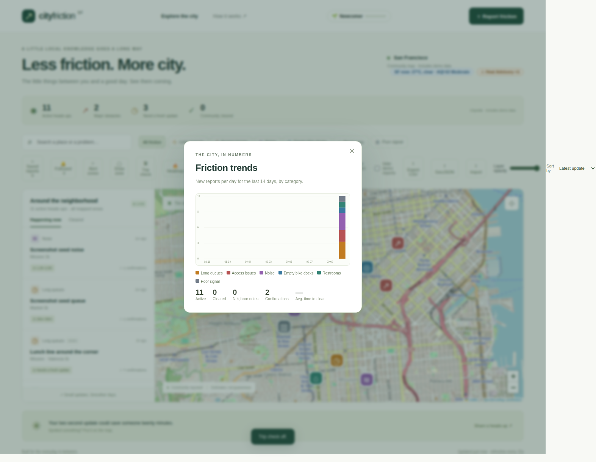
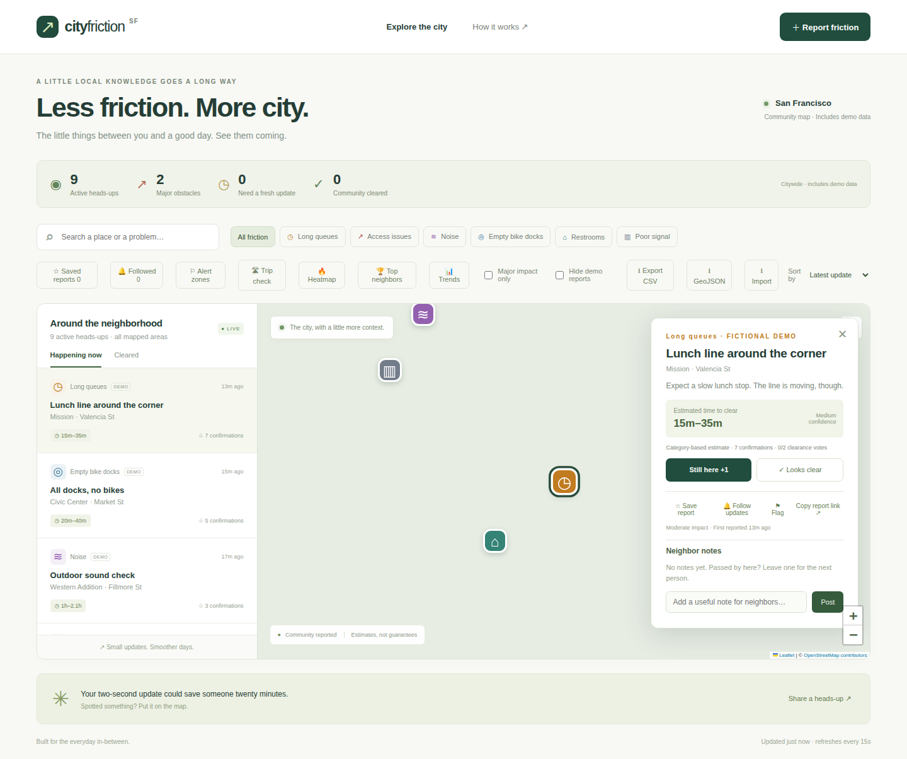
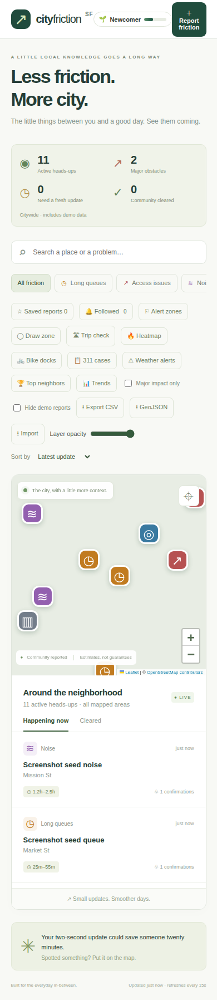
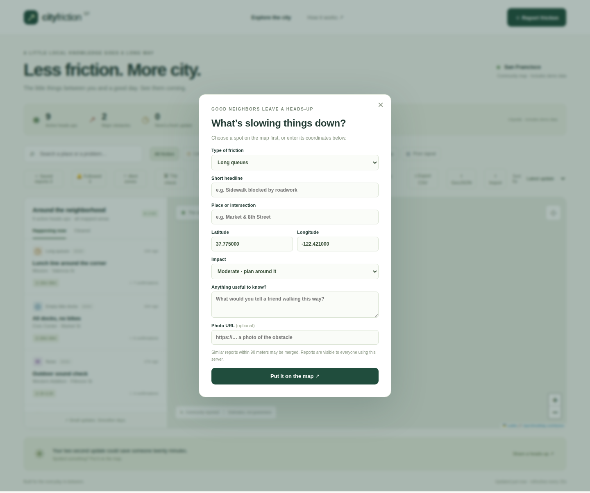

# City Friction Map

**Less friction. More city.** A community map of the everyday obstacles between you and a good day.

[](https://github.com/Sanjays2402/city-friction-map/actions/workflows/ci.yml)


Spot long queues, blocked sidewalks, noisy roadwork, empty bike docks, closed restrooms, and poor reception — now in **San Francisco, Seattle, and New York**. Share a heads-up, confirm what’s still there, and help the next person find a smoother day.

Live layers pull in real bike-share status, 311 cases, weather, air quality, and National Weather Service alerts for the selected city, and every contribution earns XP toward levels, badges, and streaks.



## Features

| Explore                                             | Contribute                                            | Keep track                                         |
| --------------------------------------------------- | ----------------------------------------------------- | -------------------------------------------------- |
| Interactive map with six categories                 | Submit a report at a chosen location                  | Save reports on your device                        |
| Search places and report text                       | Merge nearby duplicate reports                        | Open an issue from a shareable link                |
| Filter major obstacles or hide demo data            | Confirm an obstacle or vote it cleared                | View active, major, stale, and cleared counts      |
| Sort by recency, impact, or confirmations           | Two clearance votes resolve an issue                  | See explainable clearance ranges                   |
| Follow reports for update notifications             | Leave neighbor notes on any report                    | Export the filtered list as CSV                    |
| Filter to followed reports only                     | Attach a compressed photo to a report                 | See comment and photo badges on cards              |
| Flag misleading reports for review                  | Smarter duplicate merging by headline                 | Community flags hide misleading reports            |
| React “helpful” on useful neighbor notes            | Reply to neighbor notes (one level)                   | Watch areas for new friction with alert zones      |
| See the most active neighbors                       |                                                       |                                                    |
| Check friction along a planned route                | Toggle a severity heatmap                             | See 14-day trends and averages                     |
| Drag trip stops to fine-tune the route              | Time-filter the heatmap (24h / 7d)                    | Draw alert zones by dragging on the map            |
| Toggle live Bay Wheels dock availability            | Toggle live SF 311 cases on the map                   | See live SF weather in the header                  |
| Click a station to report empty docks               | Add a 311 case as a report in one click               | See live AQI next to the weather                   |
| Filter 311 cases by top case types                  | Toggle live NWS weather alerts                        | Adjust enrichment layer opacity                    |
| Rich marker popups with photos and notes            |                                                       |                                                    |
| Earn XP, levels, badges, and streaks                | Take the weekly confirmation challenge                | See level icons on the leaderboard                 |
| Export reports as GeoJSON                           | Import a GeoJSON FeatureCollection                    |                                                    |
| Keyboard shortcuts for power users                  | Installable PWA with offline shell                    |                                                    |
| **New in v1.8.0**                                   |                                                       |                                                    |
| "This area" filter for the visible map              | Filter by recency (hour / day / week)                 | Forward a report to 311 with one click             |
| Sort the list by distance ("Near me")               | Full-size photo lightbox on tap                       | Copy-ready civic summary with confirmations        |
| **New in v1.7.0**                                   |                                                       |                                                    |
| Resolve your report with an optional note           | Edit your report within 24 hours                      | "Gone quiet" tab for stale reports                 |
| Moderators can also resolve reports                 | Bulk hide/restore in the moderation queue             | Confirm a quiet report to revive it                |
| Merge duplicates into a canonical report            | Resolution notes in the activity timeline             | Shared links open stale reports directly           |
| **New in v1.6.0**                                   |                                                       |                                                    |
| Attach compressed photo evidence to reports         | Duplicate preview before filing ("already reported?") | Thank reporters with kudos (+1 XP each)            |
| Freshness badges on new reports                     | Report activity timelines                             | Moderation queue for flagged reports (admin token) |
| Embeddable `/embed?city=` map for iframes           | Public RSS feed at `/api/feed.xml`                    | Print-friendly shared report pages                 |
| **New in v1.5.0**                                   |                                                       |                                                    |
| Switch between San Francisco, Seattle, and New York | City-scoped reports, alerts, and live data            | Notification center with unread badge              |
| Dark mode with system preference detection          | Full Spanish translation                              | Offline report queue with automatic sync           |
| Shareable `/r/:id` report links                     |                                                       |                                                    |

Reports persist in SQLite and refresh across browsers every 15 seconds. The responsive interface supports desktop and mobile.

The API supports text search across titles, locations, and descriptions: `GET /api/reports?q=elevator`.

Live enrichment layers (bike-share status, 311 cases, Open-Meteo weather and air quality, NWS weather alerts) come from free keyless public APIs through cached server proxies, scoped to the selected city; when an upstream is down, its toggle quietly stands down instead of showing dead data.

## Screenshots


<table>
  <tr>
    <td width="50%"></td>
    <td width="50%"></td>
  </tr>
  <tr><td align="center">Live data layers: bike docks, 311 cases, weather alerts</td><td align="center">Trip check with draggable route stops</td></tr>
  <tr>
    <td width="50%"></td>
    <td width="50%"></td>
  </tr>
  <tr><td align="center">City karma: XP, levels, badges, streaks</td><td align="center">14-day friction trends</td></tr>
  <tr>
    <td width="70%"></td>
    <td width="30%"></td>
  </tr>
  <tr><td align="center">Report details & community verification</td><td align="center">Mobile exploration</td></tr>
</table>

<details>
<summary>See the reporting flow</summary>



</details>

Screenshots show fictional San Francisco demo reports, labeled in the interface.

## Run locally

Requires **Node.js 22.13+** and npm.

```sh
git clone https://github.com/Sanjays2402/city-friction-map.git
cd city-friction-map
npm ci
npm run dev
```

Open [localhost:3000](http://localhost:3000). No paid API keys are required; map tiles and fonts use external services.

For the production build:

```sh
npm run build
npm start
```

Data is stored in `data/friction.sqlite`. Set `SEED_DEMO=false` with a fresh database to start without sample reports. The server defaults to localhost; use `HOST=0.0.0.0` for container hosting with persistent storage.

## Stack & architecture

**JavaScript · Vite · Leaflet · Express · SQLite · Playwright · GitHub Actions**

The client handles discovery and map interactions. The Express API validates updates, and SQLite transactions keep reports and votes consistent. Duplicate detection combines category, distance, and recency. Clearance ranges use transparent rules instead of an opaque prediction model.

Read the [engineering notes](docs/architecture.md) for algorithms, API endpoints, configuration, and design tradeoffs.

## Tests

```sh
npm test
npx playwright install chromium
npm run test:e2e
```

The suite covers report validation, geographic matching, vote conflicts, database persistence and rollback, filtering, saved reports, shared links, resolution and editing, the stale-expiry lifecycle, bulk moderation and duplicate merging, and mobile layout. Browser tests build and exercise the production app. GitHub Actions runs verification on every push and pull request.

## Project scope

This is a working portfolio MVP, currently covering San Francisco, Seattle, and New York. Demo reports are fictional; clearance estimates are heuristics, not guarantees. Saved reports are browser-local, and shared links require access to the same server. Anonymous browser IDs are not verified identities. Public deployment would still need real authentication, a suitable tile provider, and an `ADMIN_TOKEN` for the moderation endpoints.

## Credits

[Leaflet](https://leafletjs.com/) · [OpenStreetMap contributors](https://www.openstreetmap.org/copyright) ([tile policy](https://operations.osmfoundation.org/policies/tiles/)) · DM Sans and Manrope via Google Fonts.
