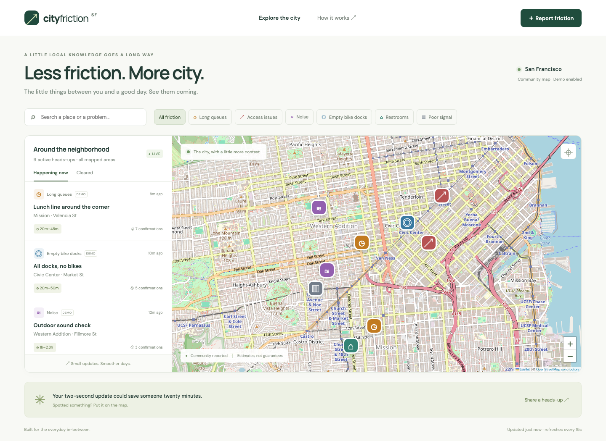

# City Friction Map

A community map of the small obstacles that change your day: coffee queues, blocked sidewalks, broken elevators, construction noise, empty bike docks, closed restrooms, and poor reception.

An original full-stack portfolio project with a responsive map, persistent reports, geographic duplicate detection, community verification, and transparent clearance estimates. The starting neighborhood is San Francisco.



## Run locally

Requires Node.js 22.13 or newer and npm. Node 22 may print an experimental warning for its built-in SQLite module.

```sh
npm ci
npm run dev
```

Open http://localhost:3000. For a production build:

```sh
npm run build
npm start
```

The server binds to localhost by default. Set `HOST=0.0.0.0` when deliberately exposing it in a container or behind a reverse proxy. This is a portfolio MVP, not a hardened public reporting service.

## Explore

- Filter six categories, search report text, and switch between active and cleared reports.
- Click a pin or report card to see details, evidence, and estimated time to clear.
- Click a map location, then choose **Report friction**. Coordinates can also be entered with the keyboard.
- New reports persist in `data/friction.sqlite` and appear for other visitors on the next 15-second refresh.
- Confirm an issue with **Still here**, or submit **Looks clear**. Two distinct browser IDs are required to resolve an issue.
- Initial reports are fictional, individually labeled **DEMO**, and never represent verified real-world conditions. Disable initial seeding with `SEED_DEMO=false` on a fresh database.

## Engineering decisions

**Small, inspectable stack.** Vanilla JavaScript and Vite build the client; Leaflet renders the map; Express serves the API and frontend; SQLite stores reports and votes. No paid API keys are required. Map tiles and fonts require internet access.

**Geographic deduplication.** A new report merges into the nearest active report of the same category within 90 meters, provided the existing report was updated in the last 90 minutes. Distances use the Haversine formula. A merge counts as a confirmation rather than replacing someone else's description. This deliberately simple approach can merge separate nearby incidents; a future version should add venue identity and text similarity. The current scan is O(n); a larger dataset needs a spatial index.

**Explainable estimates.** Category duration is multiplied by impact and measured from the most recent confirmation. The displayed range is 65–140% of that remaining duration. Evidence is labeled Low or Medium; this is not calibrated statistical confidence or a trained ML forecast. Expired estimates say **Needs a fresh update** and never auto-resolve a report.

**Verification.** A unique database constraint prevents the same browser ID from repeating an action on the same report. Browser IDs are anonymous local-storage tokens, not proof of distinct people. Clients can reset them. Production use needs accounts, abuse controls, moderation, rate limits, and audit history.

**Storage.** The application runs as one Node process with synchronous SQLite operations. Persistent hosting needs a writable disk; an ephemeral/serverless filesystem will lose data. Demo data seeds only when the report table is empty. Polling is intentionally simple; SSE is a natural extension.

## API

| Method | Endpoint                | Behavior                           |
| ------ | ----------------------- | ---------------------------------- |
| GET    | `/api/health`           | Health check                       |
| GET    | `/api/reports`          | All reports with derived estimates |
| POST   | `/api/reports`          | Create or merge a report           |
| POST   | `/api/reports/:id/vote` | Confirm or submit a clearance vote |

Writes require JSON and an `X-Visitor-Id` header (12–80 letters, numbers, or hyphens). Report fields: `category`, `title`, `location`, `description`, `lat`, `lng`, `severity` (1–3). Vote body: `{ "action": "confirm" }` or `{ "action": "clear" }`. Input is validated; SQL values are parameterized; user text is escaped in HTML; cross-origin browser writes are rejected. These measures do not replace authentication.

Configuration: `PORT` (3000), `HOST` (127.0.0.1), `DB_PATH` (`data/friction.sqlite`), `SEED_DEMO` (`true`), and `NODE_ENV`.

## Verification

```sh
npm test
npm run build
npx playwright install chromium
npm run test:e2e
```

Unit tests cover geographic distance, duplicate boundaries, invalid input, stale predictions, duplicate voting, and clearance quorum. Browser tests cover filtering, report creation, reload persistence, multi-visitor clearance, and mobile overflow. GitHub Actions runs the build and both test suites on pushes and pull requests.

## Credits

Map rendering: [Leaflet](https://leafletjs.com/reference.html). Map data and basemap: [OpenStreetMap contributors](https://www.openstreetmap.org/copyright), subject to the [tile usage policy](https://operations.osmfoundation.org/policies/tiles/). Database: [Node SQLite](https://nodejs.org/api/sqlite.html). Fonts: DM Sans and Manrope via Google Fonts. Use a dedicated tile provider for a high-traffic deployment. Automated tests block tile requests.
