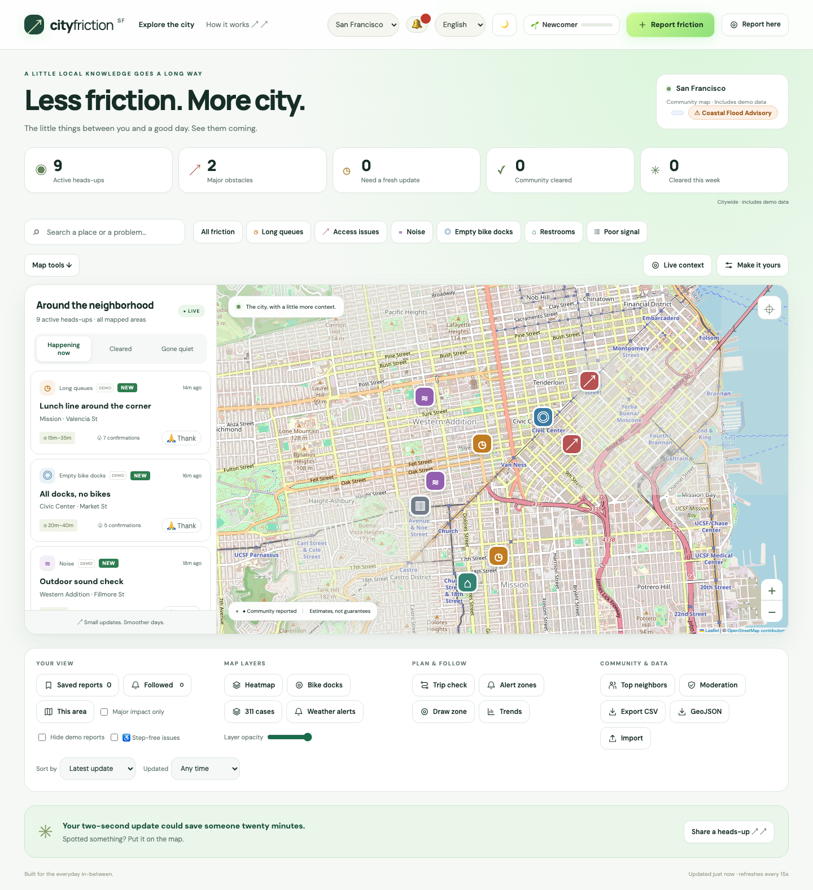
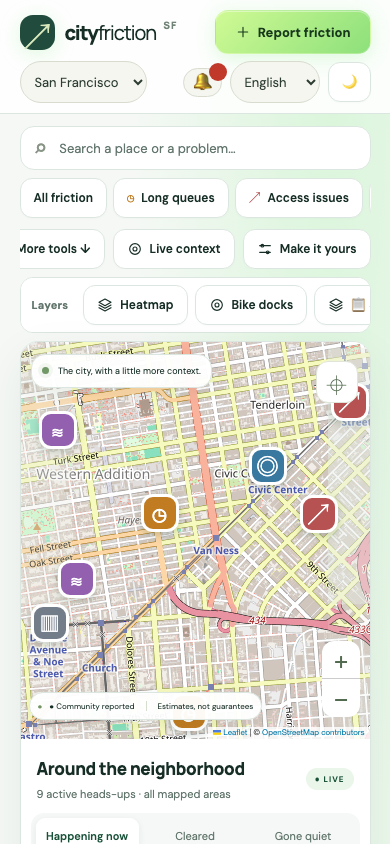
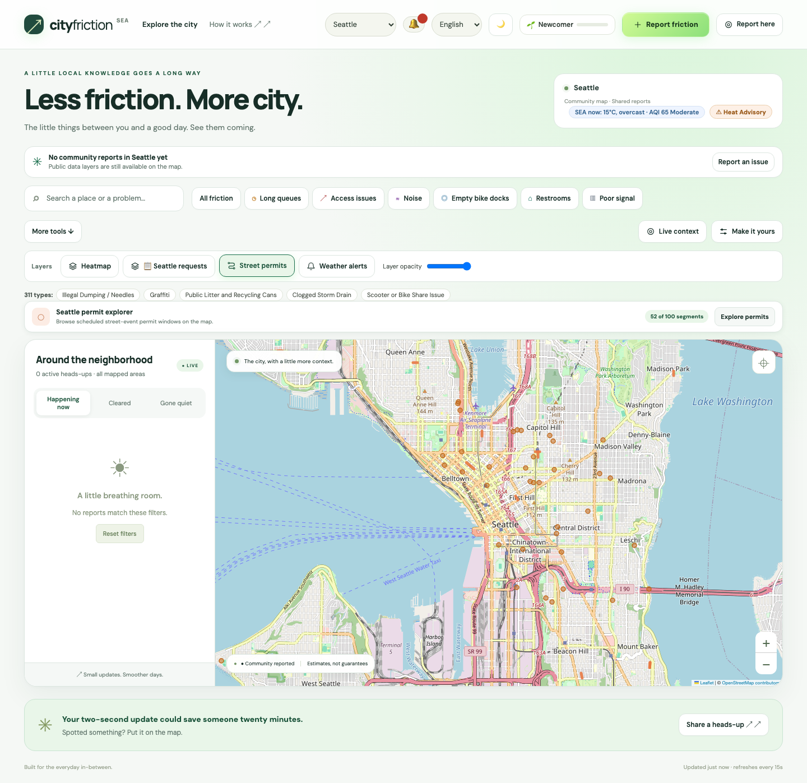
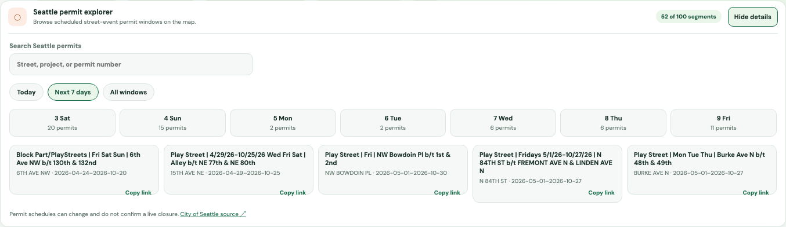
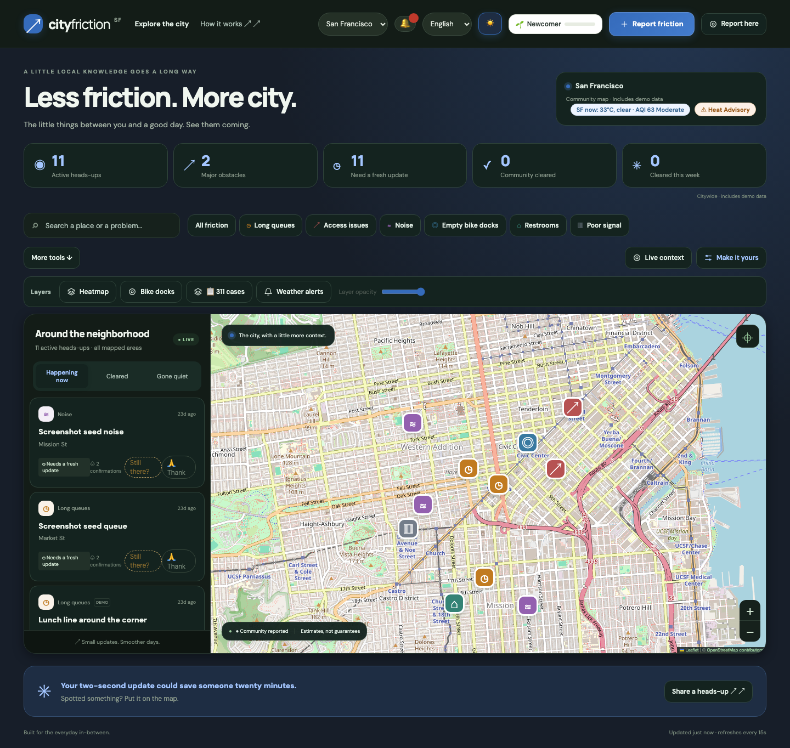
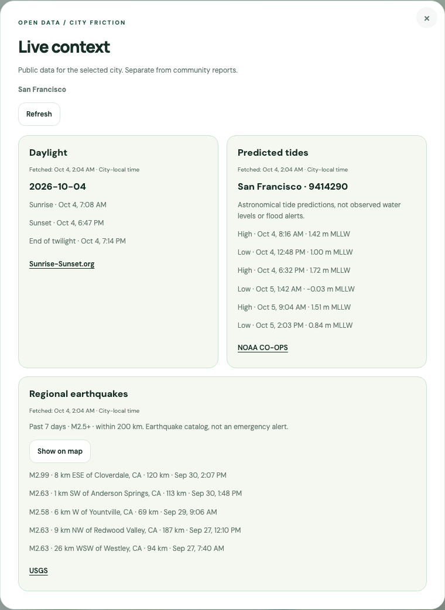
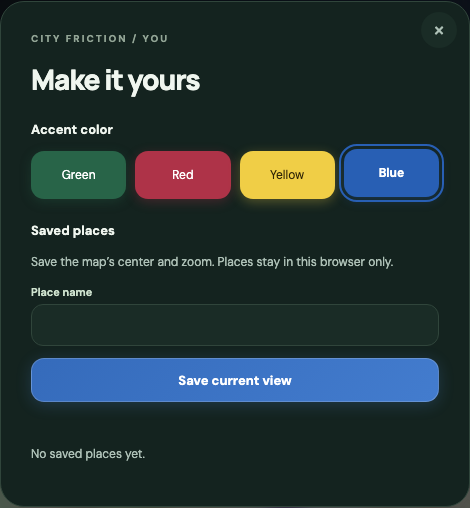
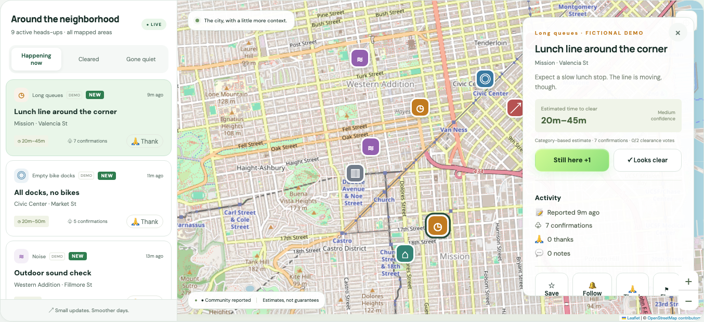
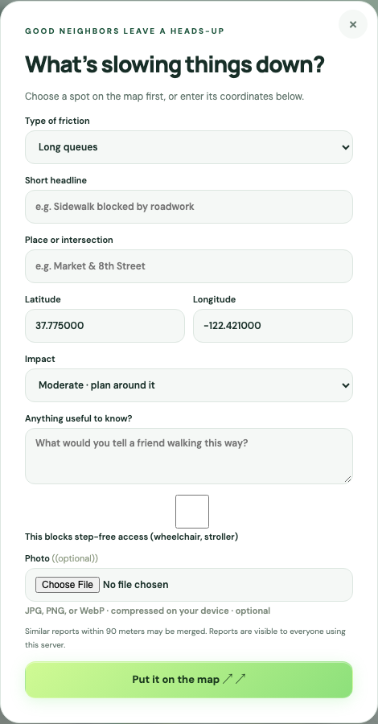

# City Friction Map

> Less friction. More city.

A community-powered map for the small obstacles that interrupt everyday life: long queues, blocked sidewalks, noisy construction, empty bike docks, closed restrooms, and poor reception. Find a heads-up, add one, or check what might affect your trip.

[](https://github.com/Sanjays2402/city-friction-map/actions/workflows/ci.yml)


**San Francisco · Seattle · New York** · Keyless public data · Light/dark mode · Four accent colors

<table>
  <tr>
    <td width="74%"></td>
    <td width="26%"></td>
  </tr>
  <tr><td>Desktop dashboard</td><td>Map-first phone view</td></tr>
</table>

**[Run the local map demo →](#quick-start)** · [Features](#what-you-can-do) · [Screenshots](#screenshots) · [Data sources](#real-data-clear-boundaries) · [Engineering notes](docs/architecture.md)

**Start with a quick tour:** launch the local demo, filter a category, open a fictional report, then try a trip check. Desktop and mobile previews are shown above.

## What you can do

- **Find a heads-up.** Search places or reports; filter by category, severity, age, visible map area, or step-free impact. Switch between San Francisco, Seattle, and New York without mixing their reports.
- **Contribute and verify.** Pin a report, attach a photo, leave a neighbor note, confirm an obstacle, or vote it cleared. Two clearance votes resolve a report; nearby duplicates can merge.
- **Plan around friction.** Draw a trip corridor, inspect a severity heatmap, or create alert zones. Trip check highlights nearby reports; it is not turn-by-turn navigation.
- **Follow and personalize.** Save reports, follow updates, bookmark named views, and explore trends. Choose the glowing green, red, yellow, or blue accent, plus light/dark mode and English/Spanish.
- **Use public context.** Toggle city-specific bike-share, maintenance-request, street-permit, and weather layers. Seattle adds a permit explorer with search, upcoming windows, and shareable segment links.
- **Take your data with you.** Export CSV or GeoJSON, import GeoJSON reports, share city or report links, embed a city map, or subscribe to RSS.

Community reports persist in SQLite and refresh across browsers every 15 seconds. Public feeds, fictional demo reports, and clearance estimates are presented as different kinds of information—not as verified live street conditions. The PWA supports an offline shell and queued reporting; external feeds still require a connection.

## Quick start

Requires **Node.js 22.13 or newer** and npm. No API keys or external database setup are needed for the local demo.

```sh
git clone https://github.com/Sanjays2402/city-friction-map.git
cd city-friction-map
npm ci
npm run dev
```

Open [localhost:3000](http://localhost:3000). San Francisco starts with **fictional, labeled demo reports**; Seattle and New York start without seeded reports. You can also open [Seattle directly](http://localhost:3000/?city=sea).

**A two-minute tour:** choose a category → open a report → toggle a map layer → open **Live context** for source-linked data → use **More tools** to check a trip or copy a city link. On phones, the map stays near the top; profile and “Report here” are inside **More tools**.

For a production build:

```sh
npm run build
npm start
```

This is a full-stack app: it needs a Node server and persistent SQLite storage. **GitHub Pages alone cannot run the API or database.** The localhost link is a local preview, not a publicly hosted demo.

## Screenshots

Fresh captures of the current interface—not design mockups. The San Francisco reports shown here are fictional demo data. Public-feed values are point-in-time responses and may change or become unavailable. Desktop and phone views are shown above.



Seattle's two city feeds appear in the compact **Layers** strip when Seattle is selected. Less-used preferences, trip planning, and data actions stay under **More tools**, folded by default on desktop and mobile. The compact permit row keeps the map visible; **Explore permits** opens search, daily counts, and shareable permit links. Entries without weekday details remain in **All windows** rather than being shown as active today. Orange dashed segments show permits, not confirmed closures.

On phones, the report list scrolls with the page instead of trapping gestures inside a short pane.

<details>
<summary><strong>Expanded permit explorer</strong></summary>



</details>

<details>
<summary><strong>Dark mode · blue accent</strong></summary>



</details>

| Live context                                                                                                                                | Personalization                                                                                                               |
| ------------------------------------------------------------------------------------------------------------------------------------------- | ----------------------------------------------------------------------------------------------------------------------------- |
|  |  |
| Three public sources, city-local times, and explicit availability.                                                                          | Four accents and browser-local saved views.                                                                                   |

<details>
<summary><strong>Report details and community verification</strong></summary>



</details>

<details>
<summary><strong>Report an obstacle</strong></summary>



</details>

## Real data, clear boundaries

The Express server fetches and caches public data; community reports remain separate from provider feeds. Availability varies by city:

| Integration                     | San Francisco       | Seattle                 | New York           |
| ------------------------------- | ------------------- | ----------------------- | ------------------ |
| Bike-share station availability | Bay Wheels          | Not connected           | Citi Bike          |
| Open civic maintenance requests | SF 311              | Find It, Fix It         | Not connected      |
| Permitted street events         | Not connected       | Seattle Street Closures | Not connected      |
| Weather and air quality         | Open-Meteo          | Open-Meteo              | Open-Meteo         |
| Weather alerts                  | NWS                 | NWS                     | NWS                |
| Regional earthquakes            | USGS                | USGS                    | USGS               |
| High/low tide predictions       | NOAA: San Francisco | NOAA: Seattle           | NOAA: The Battery  |
| Sunrise, sunset, civil twilight | Sunrise-Sunset.org  | Sunrise-Sunset.org      | Sunrise-Sunset.org |

**Live context** loads on demand and links to each provider. [USGS](https://earthquake.usgs.gov/earthquakes/feed/v1.0/geojson.php) events cover the past seven days, magnitude 2.5+, within 200 km of the city center. [NOAA](https://api.tidesandcurrents.noaa.gov/api/prod/) heights are astronomical predictions in meters relative to Mean Lower Low Water (MLLW), not observed water levels. [Sunrise-Sunset.org](https://sunrise-sunset.org/api) supplies daylight times for the city's local calendar date.

The Seattle request layer uses the city's [Customer Service Requests dataset](https://data.seattle.gov/City-Administration/Customer-Service-Requests/5ngg-rpne), limited to open public-space maintenance categories and city bounds. The permit layer uses [Seattle Street Closures](https://data.seattle.gov/Transportation/Street-Closures/ium9-iqtc), showing mapped line segments whose permit window has not ended. These feeds are published daily; neither is a real-time passability guarantee. Shared permit links depend on that current feed and may stop opening a segment after its window ends. The app caches successful proxy responses for 60 seconds and shows feed failure separately from an empty result.

Earthquakes are cached for five minutes, tide/daylight data for 30 minutes, and failures for one minute. Concurrent requests share in-flight work. An unavailable source is not presented as “no events,” and live context does not silently fall back to stale service-worker data. Refresh respects server cache limits.

No keys are required for the connected endpoints. Public providers, map tiles, and fonts require internet access and remain subject to their own availability, usage policies, and terms.

## Built to be understandable

**Vanilla JavaScript · Vite · Leaflet · Express · SQLite · Playwright · GitHub Actions**

The browser handles map interactions and discovery filters. Same-origin Express routes validate writes and proxy public APIs. SQLite stores reports, votes, comments, and related state.

Some engineering details worth exploring:

- **Geographic duplicate detection:** category, proximity, recency, and title similarity help merge repeat reports.
- **Transactional verification:** uniqueness rules and transactions protect vote updates; tests exercise rollback behavior.
- **Explainable clearance estimates:** category, severity, and recent confirmations determine a visible range rather than an opaque score.
- **Resilient integrations:** bounded upstream requests, validation, caching, request coalescing, and explicit failure states.
- **Interaction coverage:** production-browser tests cover reporting, city changes, map tools, theme persistence, keyboard focus, and responsive layouts.

See [engineering notes](docs/architecture.md) for algorithms, API endpoints, and implementation tradeoffs.

## Configuration

| Variable      | Default                | Purpose                                                               |
| ------------- | ---------------------- | --------------------------------------------------------------------- |
| `PORT`        | `3000`                 | HTTP port                                                             |
| `HOST`        | `127.0.0.1`            | Bind address; use `0.0.0.0` when required by your hosting environment |
| `DB_PATH`     | `data/friction.sqlite` | SQLite path; use persistent storage when deploying                    |
| `SEED_DEMO`   | Enabled                | Set to `false` with a fresh database to start without demo reports    |
| `ADMIN_TOKEN` | Unset                  | Enables protected moderation endpoints; keep it secret                |

For a clean local database on macOS/Linux:

```sh
SEED_DEMO=false DB_PATH=data/clean.sqlite npm run dev
```

This creates a separate database; it does not erase existing demo data.

## Development and verification

```sh
npm test                         # Unit, domain, persistence, and HTTP tests
npx playwright install chromium # One-time browser installation
npm run test:e2e                  # Builds and tests the production app
```

GitHub Actions runs verification on pushes and pull requests. Tests cover validation, geographic matching, vote conflicts, persistence, offline behavior, public-API failure states, and desktop/mobile interactions.

### Refresh the screenshots

Use a separate, disposable demo instance so your own reports are untouched. In one terminal:

```sh
npm run build
PORT=3200 DB_PATH=:memory: npm start
```

In another terminal:

```sh
node scripts/screenshots.js http://127.0.0.1:3200
```

The script captures nine PNGs in `docs/screenshots/`, uses real public feeds, and never submits reports, votes, or comments. It requires Chromium from the installation step above. Stop the demo server when finished; its in-memory data is discarded.

## Scope and limitations

This is a working portfolio project, not a verified civic reporting service or emergency-warning system. Demo reports are fictional, clearance estimates are heuristics, and tide/earthquake data do not establish safe travel conditions.

Saved reports, followed reports, theme preferences, and named views are browser-local. Anonymous browser IDs are not verified identities. Public deployment needs an authentication/abuse-prevention review, database backups, secure moderation configuration, and a suitable map-tile provider. Offline support does not make external feeds available without a connection.

## Credits

[Leaflet](https://leafletjs.com/) · [OpenStreetMap contributors](https://www.openstreetmap.org/copyright) ([tile policy](https://operations.osmfoundation.org/policies/tiles/)) · [Open-Meteo](https://open-meteo.com/) · [National Weather Service](https://www.weather.gov/documentation/services-web-api) · [USGS](https://earthquake.usgs.gov/) · [NOAA CO-OPS](https://tidesandcurrents.noaa.gov/) · [Sunrise-Sunset.org](https://sunrise-sunset.org/) · Bay Wheels/Citi Bike GBFS · [SF Open Data](https://data.sfgov.org/) · DM Sans and Manrope via Google Fonts.
